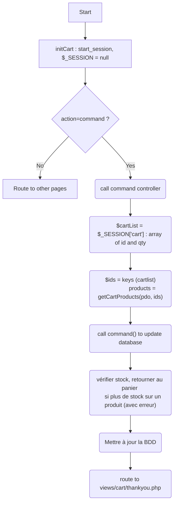

```mermaid
flowchart TD
    A[Start] --> B["initCart : start_session, $_SESSION = null"] 
    B --> C{action=command ?}
    C -->|No| E[Route to other pages]
    C -->|Yes| D[OK]
    D(call command controller) --> D1("$cartList = $_SESSION['cart'] : array of id and qty")
    D1 --> D2("$ids = keys (cartlist)
                products = getCartProducts(pdo, ids)")
    D2 --> D3("call command() to update database")
    D3 --> Z1("vérifier stock, retourner au panier 
    si plus de stock sur un produit (avec erreur)")
    Z1 --> Z2("Mettre à jour la BDD")
    Z2 --> F(route to views/cart/thankyou.php)
    
```