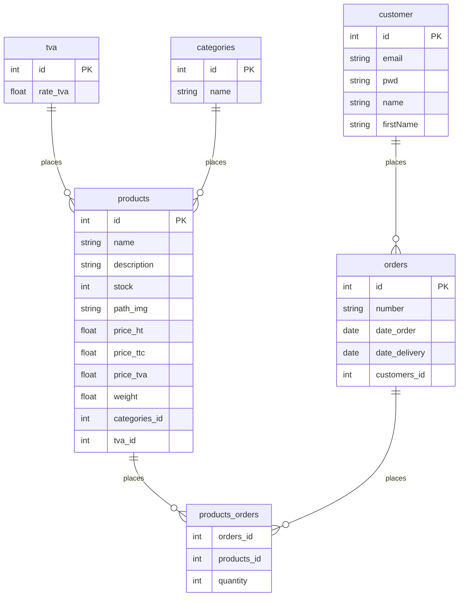

```mermaid
erDiagram
    customer ||--o{ orders: places
    customer {
        int id PK
        string email
        string pwd
        string name
        string firstName
    }
   
    products ||--o{ products_orders: places
    products {
        int id PK
        string name
        string description
        int stock
        string path_img
        float price_ht
        float price_ttc
        float price_tva
        float weight
        int categories_id
        int tva_id
    }

    tva ||--o{ products: places
    tva {
        int id PK
        float rate_tva
    }
    categories ||--o{ products: places
    categories {
        int id PK
        string name
    }
    orders ||--o{ products_orders: places
    orders {
        int id PK
        string number
        date date_order
        date date_delivery
        int customers_id
    }
    products_orders {
        int orders_id
        int products_id
        int quantity
    }
```