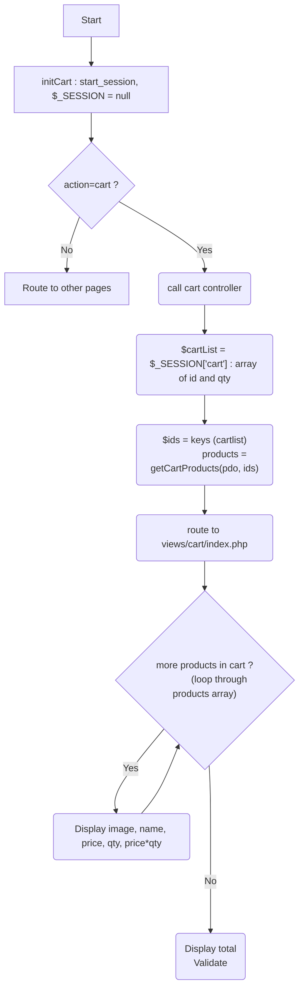

```mermaid
flowchart TD
    A[Start] --> B["initCart : start_session, $_SESSION = null"] 
    B --> C{action=cart ?}
    C -->|No| E[Route to other pages]
    C -->|Yes| D[OK]
    D(call cart controller) --> D1("$cartList = $_SESSION['cart'] : array of id and qty")
    D1 --> D2("$ids = keys (cartlist)
                products = getCartProducts(pdo, ids)")
    D2 --> F(route to views/cart/index.php)
    F --> G{"more products in cart ?
            (loop through products array)"}
    G -->|Yes| I
    I(Display image, name, price, qty, price*qty)
    I --> G
    G ---->|No| J(Display total
                Validate)
    
```